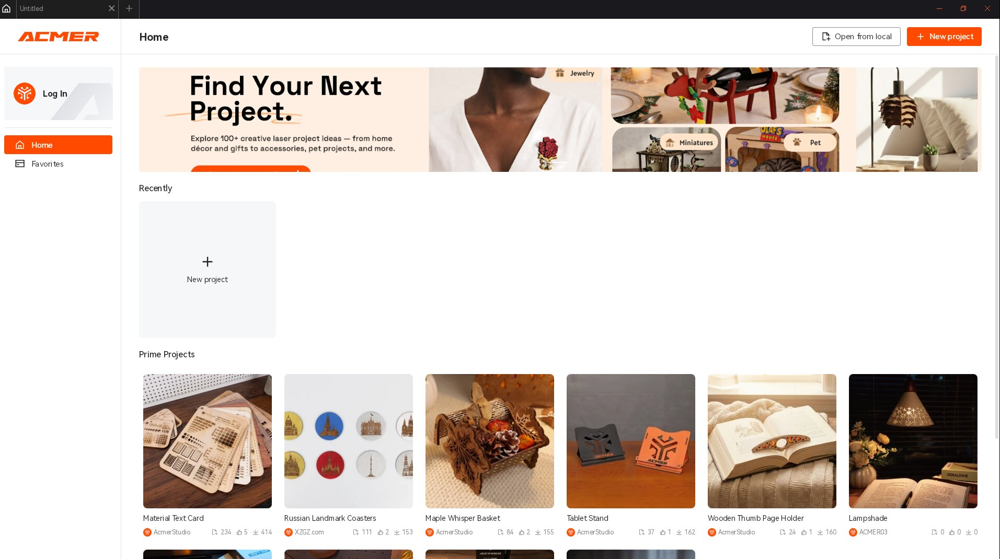
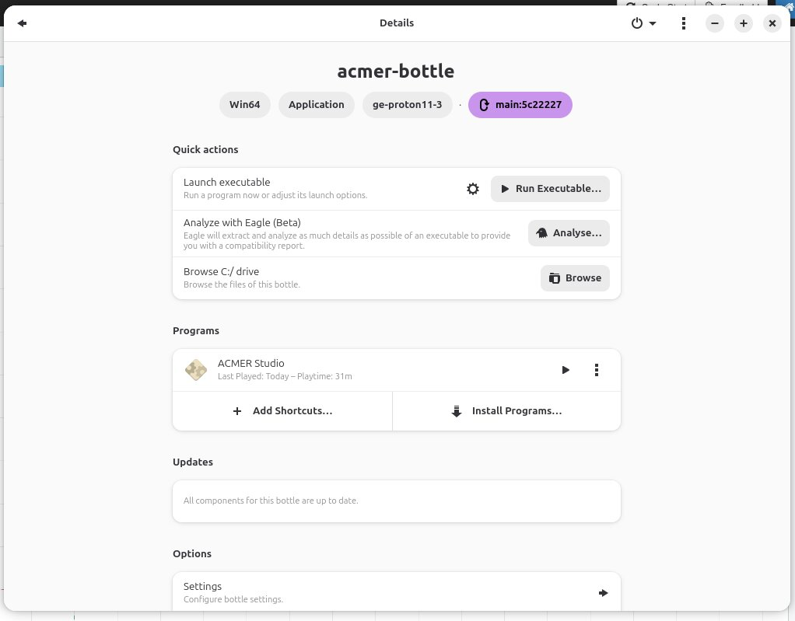
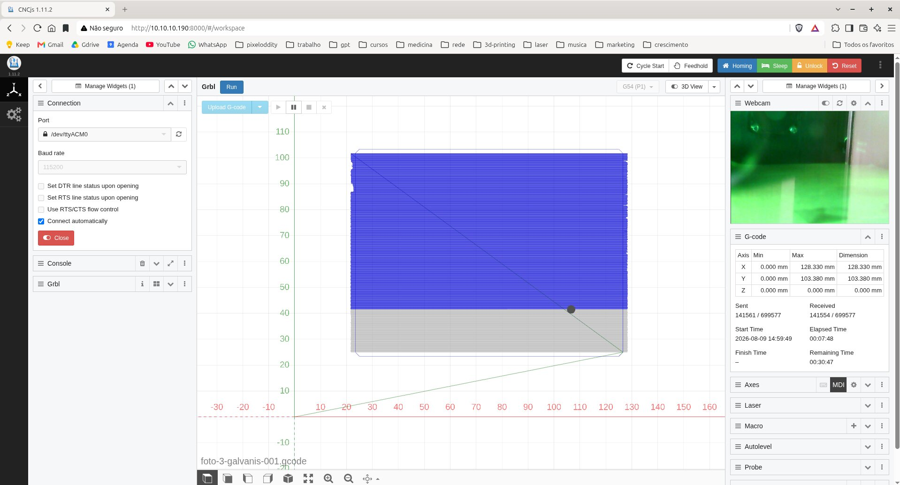

# ACMER K1 7W — Documentation

Documentation repository for the ACMER K1 7W laser engraver: hardware specs, firmware parameters, material table, and a complete guide to running ACMER Studio on Linux + cncjs print server.

## Screenshots


*ACMER Studio running on Linux via Bottles + GE-Proton*


*Bottle configuration with GE-Proton11-3 runner*


*cncjs web interface — job running with live toolpath*

## What This Repo Covers

This is a complete, tested guide for using the ACMER K1 7W blue-diode laser engraver on Linux. It covers:

- Hardware specifications and factory firmware parameters (`$$`)
- Material cutting/engraving settings (from the official 7W table)
- Setting up a print server (Debian + cncjs + webcam) for headless operation
- Running ACMER Studio on Linux via Bottles + GE-Proton (no Windows needed)

## Documents

| File | Content |
|---|---|
| [SPECIFICATIONS-K1.md](docs/SPECIFICATIONS-K1.md) | Hardware, `$$` parameters, 7W material table |
| [K1-SERVER-MANUAL.md](docs/K1-SERVER-MANUAL.md) | Printbox server (Debian + cncjs + webcam) |
| [ACMER-STUDIO-BOTTLES-MANUAL.md](docs/ACMER-STUDIO-BOTTLES-MANUAL.md) | ACMER Studio on Linux (Bottles + GE-Proton) |
| [ACMER-K1-User-Manual-EN.pdf](docs/ACMER-K1-User-Manual-EN.pdf) | Official ACMER manual (primary source) |

## Quick Start

**1. Use ACMER Studio on Linux**

Follow [ACMER-STUDIO-BOTTLES-MANUAL.md](docs/ACMER-STUDIO-BOTTLES-MANUAL.md) to install Bottles, set up the GE-Proton11-3 runner, fix keyboard dialogs, and get the tool DLLs loading.

**2. Set Up the Print Server**

Follow [K1-SERVER-MANUAL.md](docs/K1-SERVER-MANUAL.md) to install Debian on a mini PC, configure cncjs, set a static IP, and stream jobs via USB.

**3. Material Settings**

Check [SPECIFICATIONS-K1.md](docs/SPECIFICATIONS-K1.md) for the official 7W power/speed table, plus community-tested values for PLA, ABS, PETG, and corrugated cardboard.

## Architecture Overview

```
[Linux PC]  Wine/Bottles + ACMER Studio — design, power, export G-code
     │
     │  WiFi (local network) — file upload only
     ▼
[Server]  Debian + cncjs — receives file, streams via USB
     │  USB serial 115200
     ▼
[K1]  GRBL — executes the job
```

The server runs headless. Upload a G-code file, start the job, and turn off your PC — the server handles everything. Monitor from any browser (PC or phone).

## Webcam

The print server supports a live webcam feed via **ustreamer** (MJPEG stream on port 8080). The cncjs web interface has a webcam widget that consumes this stream.

Setup is covered in the [K1-SERVER-MANUAL.md](docs/K1-SERVER-MANUAL.md) section 11.


