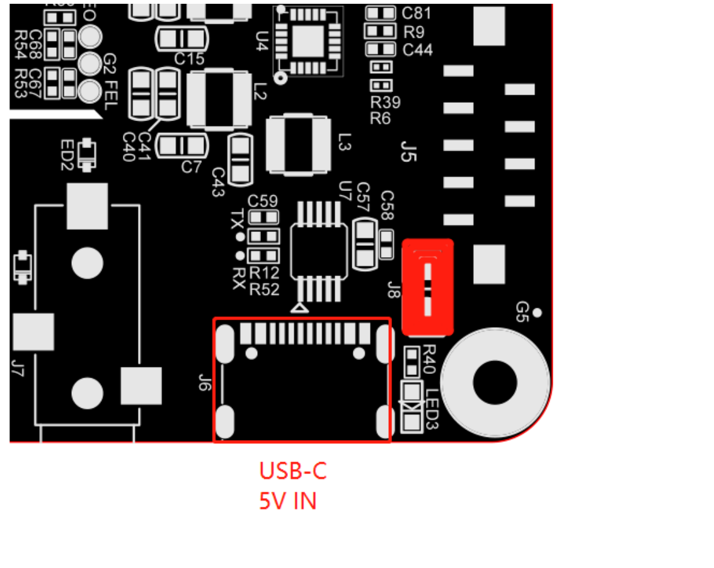

# K1 Server Manual — Debian + cncjs

> **Architecture**: you design and generate the job in LaserGRBL or ACMER Studio
> (your PC, via Wine), send the G-code file to cncjs running on the mini PC
> (server), and the server runs the K1 directly via USB. Your PC can be turned
> off — the server handles everything, and you monitor via browser (PC or
> phone).
>
> **Date**: 2026-08-08 · **Updated**: 2026-09-01 (added BTT Pi v1.2 + Armbian variant) · **cncjs v1.11.x** (verified: active releases in 2026)

```text
[Your PC]  Wine + LaserGRBL or ACMER Studio — design, power, export G-code
    │
    │  WiFi (local network) — only file upload
    ▼
[mini PC / BTT Pi]  Debian or Armbian + cncjs — receives the file, streams via USB
    │  USB serial 115200
    ▼
[K1]  GRBL — executes the job
```

**Golden rule**: all configuration (power, speed, passes, order) happens in the
design software (LaserGRBL or ACMER Studio), when generating the G-code. cncjs
has no material/power configuration — it only sends the file to the machine,
byte by byte. Nothing is repeated on the server.

---

## 1. Installing Debian on the mini PC

1. Download **Debian netinst amd64**: <https://www.debian.org/distrib/>
2. Flash to a USB stick (e.g.: `dd if=debian.iso of=/dev/sdX bs=4M status=progress`)
3. Boot from the USB and install:
   - **Hostname**: `printbox`
   - **User**: `username` + password
   - **Network**: during installation, connect to **WiFi** (the installer configures it)
   - **Partitioning**: guided, entire disk (the disk has nothing important)
   - **Software selection**: check **SSH server** + **standard system utilities**
     — **no desktop, no GNOME/KDE** (console only; nobody will use a monitor)
4. Reboot. Test with `ip a` — the WiFi IP should appear.

### 1.1. Alternative: BTT Pi v1.2 with Armbian (stable) — use this instead of §1 if you have a BTT Pi

> **Scope**: BTT Pi v1.2 is the same hardware as BigTreeTech CB1 (Allwinner H616, 1 GB RAM, AXP313A, RTL8189FTV) in Raspberry Pi form factor — same SoC, same WiFi, same USB. It uses the **CB1 Armbian image**. No separate BTT Pi image exists.
>
> **Power**: BTT Pi v1.2 has two exclusive options — `DC 5V±5% / 2A via USB Type-C` **or** `DC 12–24V via 2-pin screw terminals` — never both at once. When powering via USB-C, close `J8`; open it for 12–24V. USB-C is 5V + UART console (WCH340E), not K1 data — K1 uses the 4× USB-A ports.

**Use only the official Armbian stable image.** Do **not** use the BTT-provided `V3.0.0` image (`CB1_Debian12_Klipper_kernel6.6_20241219.img.xz`) — its vendor kernel `6.6.66-vendor-sunxi64` has an alignment-fault bug in `page_cache_ra_unbounded` that causes random segfaults, `lzma: compressed data is corrupt`, and `dpkg` failures on any `apt upgrade` — it is not maintainable. Use the official image and install cncjs manually.

1. **Download** the stable Armbian for CB1 (which is also the BTT Pi v1.2 image):
   - **Armbian 26.8.1 Minimal (CLI) — Debian 13 Trixie — kernel `current 6.18.43` — Stable — 290 MB — Build 2026-08-08** from <https://www.armbian.com/boards/bigtreetech-cb1>
   - Or via [Armbian Imager](https://imager.armbian.com/) → select `BigTreeTech CB1` → `Trixie Minimal`
2. **Flash** to SD with Balena Etcher / Raspberry Pi Imager / `dd`. No need to change `fdtfile` — default `sun50i-h616-bigtreetech-cb1-sd.dtb` in `armbianEnv.txt` is correct for BTT Pi v1.2 SD. For eMMC use `...-emmc.dtb`.

   **Power supply — use a proper 5V/3A PSU, not a random phone brick.** Spec is `5V±5% / 2A` minimum, `3A` recommended with headroom for K1 USB + webcam. A phone brick only works if it is a *dumb* 5V supply capable of 2–3A with a short thick USB-C cable (≤1 m, AWG 20/22); many fast chargers only deliver 3A after PD negotiation and will limit to 5V/1A on the BTT Pi (which does not do PD), causing brownouts, SD corruption, and WiFi drops. The safe lazy choice is a Raspberry Pi official `5V/3A USB-C (27W)` PSU. Do not power the board from a PC USB port, and do not connect USB-C 5V and 12–24V at the same time.

   
   *J8 (red) next to the USB-C port (highlighted). Source: [BIGTREETECH Pi V1.2 User Manual, p.6](https://github.com/bigtreetech/BTT-Pi/blob/master/BIGTREETECH%20Pi%20V1.2%20User%20Manual.pdf) — excerpt.*
3. **First boot**: serial via USB-C (`screen /dev/ttyUSB0 115200`) or HDMI+keyboard. Login `root` / `1234` → create user `username` → set hostname `printbox`:
   ```bash
   sudo hostnamectl set-hostname printbox
   ```
4. **Network (WiFi)**: Armbian uses NetworkManager, not `/etc/network/interfaces`:
   ```bash
   sudo armbian-config  # Network → Basic Network Setup → wlan0/wlan1 → configure
   # or
   sudo nmtui
   # or nmcli:
   sudo nmcli con add type wifi ifname wlan0 con-name printbox-wifi ssid "NETWORK-NAME" wifi-sec.key-mgmt wpa-psk wifi-sec.psk "NETWORK-PASSWORD" ipv4.method manual ipv4.addresses 10.10.10.190/24 ipv4.gateway 10.10.10.1
   sudo nmcli con up printbox-wifi
   ```
   Verify with `ip a` and `ping 10.10.10.1`.
5. **Stay on the stable kernel** — the recent ethernet regression after upgrading `6.12.68 → 6.18.33` (`sunxi_gmac.ko` missing) only affected the `edge` branch. Stay on `current` stable and hold the kernel:
   ```bash
   sudo apt-mark hold linux-image-current-sunxi64 linux-dtb-current-sunxi64
   ```
   Then continue from **§2** onwards — every other step (Node 20, cncjs, ustreamer, `dialout`, systemd, `10.10.10.190:8000`) is identical. `2.1 Disable WiFi Power Save` still applies (`wlan0` on BTT Pi). For static IP details see `2.2` note for Armbian.

---

## 2. Post-installation (once)

```bash
# Update system
sudo apt update && sudo apt upgrade -y

# Basic tools
sudo apt install -y curl iw git

# User in dialout group (access to K1 serial port)
sudo usermod -aG dialout $USER
# (log out/in after — or reboot)
```

### 2.1. Disable WiFi Power Save (mandatory)

Power save causes **latency spikes** on WiFi — and that's exactly what can
freeze a job mid-way (the machine stops with the laser on). Turn it off:

```bash
# Check the interface (ip a — usually wlp1s0 or wlan0)
ip a

# Turn off now:
sudo iw dev wlp1s0 set power_save off

# Confirm:
iw dev wlp1s0 get power_save
```

To persist after reboot, create the service:

```bash
sudo tee /etc/systemd/system/wifi-powersave-off.service > /dev/null <<'EOF'
[Unit]
Description=Disable WiFi power save
After=network-online.target
Wants=network-online.target

[Service]
Type=oneshot
ExecStart=/usr/sbin/iw dev wlp1s0 set power_save off

[Install]
WantedBy=multi-user.target
EOF

sudo systemctl enable --now wifi-powersave-off.service
```

### 2.2. Static IP

> **Armbian (BTT Pi v1.2)**: skip this file — Armbian uses NetworkManager. Use `sudo nmtui` or `sudo nmcli` as shown in §1.1. The `wifi-powersave-off.service` is still needed if you keep `wlan0`.

Configure directly on Debian (without relying on router DHCP reservation).
Edit `/etc/network/interfaces` (Debian mini PC only):

```bash
sudo nano /etc/network/interfaces
```

Replace contents with:

```text
auto lo
iface lo inet loopback

auto wlp1s0
iface wlp1s0 inet static
    address 10.10.10.190/24
    gateway 10.10.10.1
    wpa-ssid NETWORK-NAME
    wpa-psk NETWORK-PASSWORD
```

> Replace `NETWORK-NAME` and `NETWORK-PASSWORD` with your WiFi credentials.
> If the WiFi password has special characters, use quotes: `wpa-psk "password"`.

Apply:

```bash
sudo systemctl restart networking
# or reboot
```

Confirm:

```bash
ip a show wlp1s0   # should show 10.10.10.190
ping 10.10.10.1   # should respond
```

Note down `10.10.10.190` — this IP goes in the browser, always.

### 2.3. SSH Test (optional, but recommended)

The mini PC has no monitor — manage it via SSH from your PC:

```bash
ssh username@10.10.10.190
```

---

## 3. Installing cncjs

```bash
# Node.js + npm (Debian 13 ships Node 20.x — cncjs needs ≥12)
sudo apt install -y nodejs npm

# cncjs (global install; --unsafe-perm is required with sudo)
sudo npm install --unsafe-perm -g cncjs@latest

# Confirm version (should show 1.11.x)
cncjs --version
```

### 3.1. Minimal Configuration (`~/.cncrc`)

```bash
mkdir -p ~/gcode
cat > ~/.cncrc <<'EOF'
{
  "controller": "Grbl",
  "baudrates": [115200, 250000],
  "watchDirectory": "/home/username/gcode"
}
EOF
```

- `controller: Grbl` — the K1 is GRBL
- `baudrates: 115200` — K1 baud rate
- `watchDirectory` — monitored folder: files dropped there appear in the web UI
- cncjs automatically adds `state` and `secret` when saving preferences via the web UI

### 3.2. systemd Service (starts automatically on boot)

```bash
sudo tee /etc/systemd/system/cncjs.service > /dev/null <<'EOF'
[Unit]
Description=cncjs web controller
After=network-online.target
Wants=network-online.target

[Service]
Type=simple
User=username
ExecStart=/usr/local/bin/cncjs -H 0.0.0.0 -p 8000 --controller Grbl
Restart=on-failure
RestartSec=5

[Install]
WantedBy=multi-user.target
EOF

sudo systemctl enable --now cncjs.service

# Verify it's running:
ss -ltn | grep 8000
```

> If `which cncjs` shows a different path, adjust the `ExecStart`.

---

## 4. USB Connection with the K1

1. **Plug the K1 USB cable into the mini PC** and turn on the machine.
2. Find the device:

   ```bash
   ls /dev/ttyACM* /dev/ttyUSB*
   ```

   → in practice, it will be `/dev/ttyACM0` (same device your PC uses today).
3. Confirm it's the K1:

   ```bash
   lsusb
   ```

   (look for the board — CH340 appears as `1a86:7523`, WCH/ACM as CDC)

**If the device changes** (K1 re-plugged may become `ttyACM1`): restart cncjs:

```bash
sudo systemctl restart cncjs
```

The device is `/dev/ttyACM0` — use that name in cncjs.

---

## 5. cncjs Configuration (web UI)

1. In your PC browser: **`http://10.10.10.190:8000`**
2. **Connect** (top corner):
   - **Controller**: `Grbl`
   - **Serial port**: `/dev/ttyACM0`
   - **Baud rate**: `115200`
   - **Connect**
3. The GRBL status should appear (Idle, position, firmware version).
4. **Sanity test**: use the jog panel (arrows) — the K1 should move.
5. **DO NOT touch** the override sliders (feedrate/laser) — the job uses the
   file values; override only if you want to change on the fly, consciously.

---

## 6. Day-to-Day Workflow

### 6.1. In LaserGRBL / ACMER Studio (your PC, via Wine) — generate the job

1. Design and configure everything (power, speed, passes)
2. **Export G-code** → save e.g.: `placard.nc`
   - The file contains EVERYTHING: power, speed, passes, order

### 6.2. Send to the server

**Method 1 — browser**: cncjs → G-code tab → **Upload** → select `placard.nc`

**Method 2 — monitored folder**: copy the file to `~/gcode` on the mini PC
(`scp placard.nc username@10.10.10.190:/home/username/gcode/`) — it appears in the web UI
by itself.

### 6.3. Run

1. Select the file in the list → **Load**
2. Check the visualizer (toolpath) and machine position
3. **Run** → the server streams the job via USB
4. **Turn off the PC** — the job continues; monitor from your phone at
   `http://10.10.10.190:8000`
5. Buttons available during the job: **Pause**, **Resume**, **Cancel**

---

## 7. Recommended Tests in the First Week

1. **Connection test**: connect, read status, jog in all directions
2. **Small job**: a paper placard (already validated) via cncjs
3. **"PC off" test**: start a job, turn off the laptop, confirm the job finishes
   and the server shows 100%
4. **Pause/cancel test**: pause midway, resume, then cancel — the K1 should
   respond correctly

---

## 8. Maintenance

```bash
# Update cncjs
sudo npm install --unsafe-perm -g cncjs@latest
sudo systemctl restart cncjs

# View logs
journalctl -u cncjs -f

# Reboot everything (mini PC)
sudo reboot
```

After reboot, WiFi power save off and cncjs start automatically (systemd).
Verify with `iw dev wlp1s0 get power_save` and `ss -ltn | grep 8000`.

---

## 9. Troubleshooting

| Symptom | Cause | Solution |
|---|---|---|
| Web UI won't open | cncjs not running / wrong IP | `ss -ltn \| grep 8000`; `ip a`; restart the service |
| "No serial port found" | user not in dialout / USB loose | `sudo usermod -aG dialout $USER` + re-login; check `ls /dev/ttyACM*` |
| Port changed after re-plugging K1 | USB re-enumeration | `sudo systemctl restart cncjs` (or udev rule, section 4) |
| Job freezes mid-way / machine stops with laser on | WiFi power save active | `iw dev wlp1s0 get power_save` → should say `off` |
| "Port in use" when connecting | another program opened the serial | nothing else can use the port; restart cncjs |
| Phone can't access | AP isolation on router | disable "client isolation" on WiFi |
| Job starts but runs slow/with gaps | Congested 2.4GHz WiFi | prefer 5GHz on the mini PC (if supported) |
| K1 stalls at `<Home>` after jog | homing stall after manual movement | **Unlock** button in cncjs, or `$X` in MDI console, or power-cycle |

---

## 10. Security (one rule only)

**Do not open port 8000 to the internet** (no port forwarding on the router).
cncjs is for use on your local network — and on the LAN, without a password,
is the normal usage pattern for this tool. If you ever need external access,
set up a VPN — do not expose the port.

---

## 11. Webcam (optional)

cncjs has a webcam widget that consumes an external MJPEG stream.
Use `ustreamer` to expose the server's USB webcam.

```bash
# Install
sudo apt install -y ustreamer

# systemd service
sudo tee /etc/systemd/system/ustreamer.service > /dev/null <<'EOF'
[Unit]
Description=uStreamer MJPEG webcam
After=network-online.target
Wants=network-online.target

[Service]
Type=simple
User=username
ExecStart=/usr/bin/ustreamer --host=0.0.0.0 --port=8080 --device=/dev/video0 -r 1280x720 -f 15
Restart=on-failure
RestartSec=5

[Install]
WantedBy=multi-user.target
EOF

sudo systemctl daemon-reload
sudo systemctl enable --now ustreamer.service
```

In cncjs, enable the **Webcam Widget** and configure the URL:
`http://10.10.10.190:8080/stream`.

---

## Architecture Summary (what runs where)

| Component | Where | Role |
|---|---|---|
| LaserGRBL / ACMER Studio | Your PC (Wine) | Design, power, **export G-code** |
| cncjs | mini PC (Debian) or BTT Pi v1.2 (Armbian) | Web UI, receives file, **streams via USB** |
| K1 | — | Executes (GRBL) |
| ustreamer | mini PC (Debian) or BTT Pi v1.2 (Armbian) | Webcam MJPEG stream (port 8080), consumed by cncjs widget |
| WiFi | between PC and mini PC | Only file upload (job runs locally on server) |
